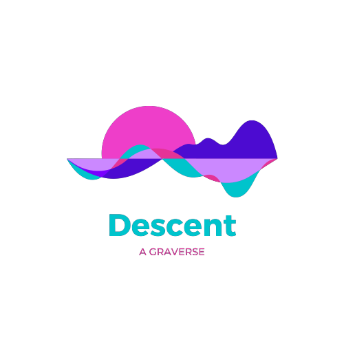

# Descent ~ A Graverse 

  

#### _A Gradient Universe which will mak you fall in love with Gradients_ 

## Table of Contents  
1. [About The Project](#about-the-project)
2. [Built With](#built-with)
3. [Getting Started](#getting-started)
4. [Features](#features)
5. [Contributing](#contributing)

## About The project
##### Descent is a gradient library which is made to flexible the use of Gradients. It contains two types of gradients:

- Linear Gradient
- Radial Gradient

✨VOILA....It's ready to use✨

## Built with  
##### Descent is built with running technologies like:-
 * HTML
 * CSS
 * JavaScript
 

## Getting started 

##### Follow the steps below to get started with Descent:-
1. Open the web app `https://descent-a-graverse.vercel.app/`
2. Go to `Gradients` section.
3. Click on `Click to copy` button.
4. Your code has been copied.
5. Paste it in your `Style code`.
6. Furthermore, there is a `Trial` section in navbar which will provide you an online editor.

## Features
- Easy to find styles.
- Quickest way to select, copy, and paste gradients of your choice
- Provides you an online editor too.
- Both linear and radial gradients are available.

As `Walt Disney` said 

> The best way to get started is 
>to quit talking and start doing

## Contributing 
  Contribution is what makes open source amazing place to learn, inspire and insightful. All the Pull requests are welcome. For major changes, please open an issue first to discuss what you would like to change.
  Steps to be followed while contributing:-
1. `Fork` the Project.
2. Create your Feature Branch `git checkout -b branch_name`.
3. Add the files `git add .`
3. Commit your Changes `git commit -m "<type>: Add message about your changes (mention-issue-ID)"`.
4. Push to the Branch `git push origin branch_name`.
5. Open a Pull Request. 

